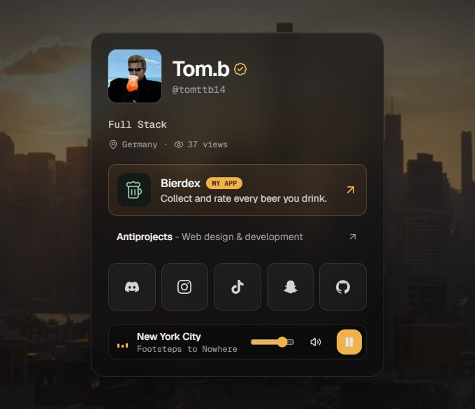

  

<h3 align="center">Hey, I'm Tom</h3>

  Full stack developer from Germany. I build web apps, mobile apps, Java plugins and mods, and Discord bots.

  
  
  

 

### Live

| Project | What it is | Stack |
| :-- | :-- | :-- |
| [**Bierdex**](https://www.bierdex.app) | Collect and rate the beers you drink, on the web and as an Android app | Next.js, Capacitor |
| [**Antiprojects**](https://antiprojects.de) | My site for web design and development work | Next.js, Tailwind |

 

### What I work on

- **Web apps and sites** with TypeScript, React and Next.js, from landing pages to internal dashboards
- **Mobile apps** for Android, built from the same web stack and shipped as real offline apps
- **Minecraft in Java**: server plugins and mods, from small utilities to full gameplay systems
- **Discord bots** in Node.js for communities: tickets, onboarding, moderation
- **Tools and experiments**: automation scripts, AI-assisted tooling, 3D and game prototypes

Most repositories are private. The projects above are the ones you can try yourself.

 

### Stack

 

### Contact

  
  
  

